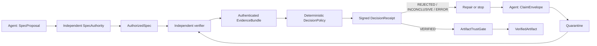

# Verification-First Harness

An experimental trust kernel for agent workflows where **every agent output is an
untrusted claim** and only an independently verified artifact may propagate.

The project optimizes for error containment rather than agent count. Version 0.2.0
adds a domain-neutral JSON protocol for authorized specifications, role-neutral
claims, authenticated evidence, deterministic verdicts, signed decision receipts,
and capability-oriented propagation. The original Python coding loop remains as a
compatible reference adapter.

> Status: **alpha / research prototype**. The protocol and public API may change
> before 1.0. The built-in Python subprocess runner is not a hostile-code sandbox.

[简体中文](README.zh-CN.md)

## Core invariants

1. Every agent is untrusted.
2. Every agent output is a claim, not a fact.
3. No unverified claim may propagate downstream.
4. Agents challenge previous work instead of blindly inheriting it.
5. Independent verification is preferred over LLM self-judgment.
6. Failure, repair, and re-verification are normal control flow.
7. The system optimizes for error containment, not agent count.

These are enforced as protocol boundaries, not prompt suggestions. A claim remains
quarantined until an authorized specification, authenticated evidence, a
deterministic `VERIFIED` decision, and a valid single-use receipt all agree. Only
then can `ArtifactTrustGate` issue a payload-carrying `VerifiedArtifact`.



## What 0.2.0 provides

- `SpecProposal` separated from independently signed `AuthorizedSpec`.
- Immutable `ClaimEnvelope` values for Planner, Worker, Critic, Reviewer, Verifier,
  Master, and Sub-Agent roles.
- Explicit `VERIFIED`, `REJECTED`, `INCONCLUSIVE`, and `ERROR` verdicts.
- Criteria-to-obligation-to-observation traces checked by deterministic policy.
- Separately authenticated `EvidenceBundle` and controller-issued `DecisionReceipt`.
- Exact binding to run context, nonce, spec, claim, attempt, evidence, and protocol.
- Single-use receipt consumption and cross-run replay protection.
- `VerifiedArtifact` as the only public generic value that carries claim payload
  with downstream propagation authority.
- Canonical JSON evidence and receipt export, plus a hash-chained audit interface.
- A compatibility bridge that routes the sequential Python repair loop through the
  generic kernel without removing its 0.1.x result fields.
- Fail-closed agent boundaries, bounded critic challenges, fresh Python processes,
  and parent-enforced test timeouts from 0.1.1.

See the [invariant coverage matrix](docs/invariants.md),
[architecture](docs/architecture.md), and [threat model](docs/threat-model.md) for
the exact guarantees and assumptions.

A complete minimal generic flow is available in
[`examples/generic_kernel.py`](examples/generic_kernel.py).

## Quick start

Python 3.10 or newer is required.

```bash
python -m venv .venv
python -m pip install -e .
python -m verification_harness.main
```

For development:

```bash
python -m pip install -e ".[dev]"
ruff check .
mypy src
pytest
python -m build
```

## Python coding-loop example

```python
from verification_harness.agents import (
    CriticAgent,
    PlannerAgent,
    VerifierAgent,
    WorkerAgent,
)
from verification_harness.engine import TrustGateEngine
from verification_harness.schema import TestCase

planner = PlannerAgent()
planner.register_task(
    task_id="add_one",
    description="Increment an integer.",
    requirements=("Return input plus one.",),
    test_cases=(TestCase("one", 1, 2),),
    entrypoint="add_one",
)

worker = WorkerAgent(
    faulty_implementations={"add_one": "def add_one(x): return x"},
    repaired_implementations={"add_one": "def add_one(x): return x + 1"},
)

result = TrustGateEngine(
    planner=planner,
    worker=worker,
    critic=CriticAgent(),
    verifier=VerifierAgent(signing_key=b"replace-with-32-or-more-secret-bytes"),
    max_repairs=1,
).run("add_one")

assert result["status"] == "APPROVED"
assert result["verdict"] == "VERIFIED"
assert result["artifact"] is not None
```

The legacy `claim` and `receipt` fields remain available for diagnosis and repair.
Only `artifact` represents approved downstream propagation. Rejected or failed runs
always return `artifact=None`.

## Connecting different models and domains

The coding engine depends on structural interfaces, not a model API. A GPT-backed
Planner, Grok-backed Worker, and Claude-backed Critic may be supplied together.
Model diversity can reduce correlated failures, but it never replaces independent
evidence or grants propagation authority.

The generic `VerificationKernel` is not tied to Python source. Its payloads are
detached JSON values, so adapters can represent plans, research claims, math
answers, documents, patches, or other domains. Each domain must still provide:

- an authority for acceptance criteria;
- an independent evidence collector with an authenticated identity;
- deterministic decision rules for the evidence it understands;
- a secure execution or retrieval boundary appropriate to that domain.

If no trustworthy oracle exists, the correct result is `INCONCLUSIVE`, not an LLM
vote disguised as verification.

## Security boundary

The package enforces protocol integrity and fail-closed control flow. It does not
make arbitrary in-process Python code trustworthy. A module running in the same
interpreter can inspect memory or monkey-patch objects. Hostile agent adapters,
verification tools, and candidate programs therefore require process, container,
microVM, VM, or OS-level isolation with no ambient credentials and explicit
network, filesystem, CPU, memory, disk, output, and process limits.

The built-in replay registry and audit sink are process-local references, not
durable distributed security services. Production deployments need transactional
persistent storage, external key management, and a hardened verifier boundary.

Report security issues according to [SECURITY.md](SECURITY.md).

## Current limitations

Version 0.2.0 does not yet provide repository-level verifier plugins, a container
execution backend, durable replay/audit storage, parallel workers, receipt-gated DAG
scheduling, or non-code domain packs. The Python compatibility adapter maps legacy
checks to criteria coarsely; domain-specific adapters should define precise traces.

These boundaries are tracked in the [roadmap](docs/roadmap.md).

## Contributing and license

Contributions are welcome. Read [CONTRIBUTING.md](CONTRIBUTING.md) and the
[Code of Conduct](CODE_OF_CONDUCT.md). Licensed under Apache-2.0.
