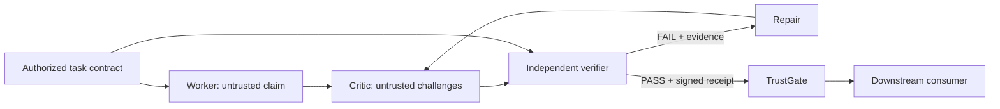

# Verification-First Harness

An experimental control plane for agent workflows where **every agent output is
an untrusted claim** and only independently verified claims may propagate.

The project optimizes for error containment rather than agent count. It provides
a small, model-independent Python core for proposing candidate code, challenging
it, executing deterministic checks, repairing failures, and issuing signed
verification receipts.

> Status: **alpha / research prototype**. The protocol and public API may change
> before 1.0. The built-in subprocess runner is not a hostile-code sandbox.

[简体中文](README.zh-CN.md)

## Core invariants

1. Every agent is untrusted.
2. Every agent output is a claim, not a fact.
3. No unverified claim may propagate downstream.
4. Critics try to falsify previous work instead of blindly inheriting it.
5. Deterministic verification is preferred over LLM self-judgment.
6. Failure, repair, and re-verification are normal control flow.
7. Reliability and error containment matter more than the number of agents.

These invariants define the trust model. Version 0.1.1 enforces them for a narrow
Python coding-task workflow: the task contract is authorized out of band, the
Worker emits an untrusted code `Claim`, the Critic proposes additional checks,
and only a complete, authentic PASS receipt can cross the `TrustGate`.



## What it provides

- Canonical SHA-256 digests for task contracts and candidate claims.
- HMAC-SHA-256 receipts covering the claim, spec, attempt, obligations, evidence,
  protocol version, and run ID.
- A fail-closed `TrustGate` that checks all bindings before propagation.
- A fail-closed component boundary that converts agent exceptions and malformed
  values into structured rejection records.
- A `ChallengePolicy` that bounds critic influence before proposed obligations
  reach the verifier.
- Canonical detached snapshots that prevent an agent from mutating the
  controller-owned spec, challenge payloads, or repair receipt in place.
- Authentication of failed receipts before their evidence may inform a repair.
- Fresh-process execution and parent-enforced timeout for every test case.
- Structural Python protocols for model- and provider-independent agents.
- A deterministic reference Planner, Worker, Critic, and Verifier.
- Cross-platform tests, linting, type checking, package builds, and tag releases.

## Quick start

Python 3.10 or newer is required.

```bash
python -m venv .venv
python -m pip install -e .
python -m verification_harness.main
```

For development:

```bash
python -m pip install -e ".[dev]"
ruff check .
mypy src
pytest
python -m build
```

## Minimal use

```python
from verification_harness.agents import (
    CriticAgent,
    PlannerAgent,
    VerifierAgent,
    WorkerAgent,
)
from verification_harness.engine import TrustGateEngine
from verification_harness.schema import TestCase

planner = PlannerAgent()
planner.register_task(
    task_id="add_one",
    description="Increment an integer.",
    requirements=("Return input plus one.",),
    test_cases=(TestCase("one", 1, 2),),
    entrypoint="add_one",
)

worker = WorkerAgent(
    faulty_implementations={"add_one": "def add_one(x): return x"},
    repaired_implementations={"add_one": "def add_one(x): return x + 1"},
)

engine = TrustGateEngine(
    planner=planner,
    worker=worker,
    critic=CriticAgent(),
    verifier=VerifierAgent(signing_key=b"replace-with-32-or-more-secret-bytes"),
    max_repairs=1,
)

result = engine.run("add_one")
assert result["status"] == "APPROVED"
```

Every engine result contains a `failure` field. It is `None` for ordinary verified
or test-rejected runs and contains a structured `ComponentFailure` when an agent,
policy, verifier, or receipt boundary fails closed.

## Connecting different models

The engine depends on structural interfaces in
`verification_harness.interfaces`, not on a specific API. A GPT-backed planner,
Grok-backed worker, or Claude-backed critic can be supplied without changing the
engine. Their outputs remain untrusted; the deterministic verifier retains the
final decision.

Provider adapters should enforce their own request timeouts. The in-process
component boundary contains reported timeout exceptions but cannot safely stop an
arbitrary thread that ignores cancellation.

Do not put model API keys or the receipt-signing key in candidate execution
environments. The signing key belongs to the trusted controller. Set
`VERIFICATION_HARNESS_SIGNING_KEY` from a secret manager when receipts must remain
verifiable across controller restarts.

## Security boundary

The default runner contains ordinary crashes, `SystemExit`, and infinite loops,
but a normal subprocess is not a security sandbox. Candidate code can access
resources available to the current OS account. Run hostile code in a separate
container, microVM, VM, or OS sandbox with no ambient credentials and explicit
network, filesystem, CPU, memory, disk, output, and process limits.

See [the threat model](docs/threat-model.md) before production use. Report
security issues according to [SECURITY.md](SECURITY.md).

## Project scope and limitations

The current release proves a narrow coding-task loop. It does not yet provide:

- authorization of planner-produced acceptance criteria;
- a general claim envelope for Planner and Critic outputs;
- container or microVM execution backends;
- parallel multi-worker scheduling or consensus;
- DAG-level receipt propagation;
- persistent append-only audit storage.

These boundaries are explicit in [the architecture](docs/architecture.md) and
[roadmap](docs/roadmap.md).

## Contributing and license

Contributions are welcome. Read [CONTRIBUTING.md](CONTRIBUTING.md) and the
[Code of Conduct](CODE_OF_CONDUCT.md). Licensed under Apache-2.0.
