# Verification-First Harness

An experimental trust kernel for agent workflows where **every agent output is an
untrusted claim** and only an independently verified artifact may propagate.

The project optimizes for error containment rather than agent count. The 0.3.0 beta
adds a provider-neutral sequential runtime, a first-party Codex SDK provider,
fail-closed action authorization, verifier plugins, and durable SQLite trust labels
around the domain-neutral 0.2.0 protocol. The original Python coding loop remains as
a compatible reference adapter.

> Status: **beta / research prototype**. The protocol and public API may change
> before 1.0. The built-in Python subprocess runner is not a hostile-code sandbox.

[简体中文](README.zh-CN.md)

## Core invariants

1. Every agent is untrusted.
2. Every agent output is a claim, not a fact.
3. No unverified claim may propagate downstream.
4. Agents challenge previous work instead of blindly inheriting it.
5. Independent verification is preferred over LLM self-judgment.
6. Failure, repair, and re-verification are normal control flow.
7. The system optimizes for error containment, not agent count.

These are enforced as protocol boundaries, not prompt suggestions. A claim remains
quarantined until an authorized specification, authenticated evidence, a
deterministic `VERIFIED` decision, and a valid single-use receipt all agree. Only
then can `ArtifactTrustGate` issue a payload-carrying `VerifiedArtifact`.

```mermaid
flowchart LR
    P["Agent: SpecProposal"] --> A["Independent SpecAuthority"]
    A --> S["AuthorizedSpec"]
    S --> T["AgentProvider request"]
    T --> AG["ActionGate"]
    AG --> C["Agent: ClaimEnvelope"]
    C --> Q["SQLite quarantine"]
    S --> V["Independent verifier"]
    Q --> V
    V --> E["Authenticated EvidenceBundle"]
    E --> D["Deterministic DecisionPolicy"]
    D --> R["Signed DecisionReceipt"]
    R -->|"VERIFIED"| G["ArtifactTrustGate"]
    G --> X["VerifiedArtifact"]
    R -->|"REJECTED / INCONCLUSIVE / ERROR"| F["Repair or stop"]
    F --> C
```



## What the 0.3.0 beta adds

- Provider-neutral `AgentProvider`, `AgentRequest`, and detached `AgentOutput` values.
- A local `CommandAgentProvider` wire adapter that uses strict JSON over stdin/stdout
  without shell interpolation.
- An optional `CodexAgentProvider` over OpenAI's
  [official Python SDK](https://developers.openai.com/codex/sdk), with a fresh
  ephemeral thread per request, structured output, a read-only default sandbox, and
  restrictive approval/tool configuration.
- `ActionGate` decisions for agent and verifier invocation, with default-deny
  allow-list policy and optional independent approval.
- A `VerifierRegistry` and bounded `CommandVerifierPlugin` for deterministic external
  checks over canonical claim envelopes.
- `VerificationRuntime` with bounded rejection, repair, and re-verification control
  flow; failed attempts expose metadata and receipts but no raw claim payload.
- `SQLiteRunStore` with explicit `AUTHORIZED`, `QUARANTINED`,
  `AUTHENTICATED_EVIDENCE`, `DECISION_ONLY`, and `VERIFIED` labels.
- Durable single-use receipt consumption across controller restarts.
- A runtime CLI demo and durable-record inspector.

The underlying 0.2.0 trust kernel continues to provide:

- `SpecProposal` separated from independently signed `AuthorizedSpec`.
- Immutable `ClaimEnvelope` values for Planner, Worker, Critic, Reviewer, Verifier,
  Master, and Sub-Agent roles.
- Explicit `VERIFIED`, `REJECTED`, `INCONCLUSIVE`, and `ERROR` verdicts.
- Criteria-to-obligation-to-observation traces checked by deterministic policy.
- Separately authenticated `EvidenceBundle` and controller-issued `DecisionReceipt`.
- Exact binding to run context, nonce, spec, claim, attempt, evidence, and protocol.
- Single-use receipt consumption and cross-run replay protection.
- `VerifiedArtifact` as the only public generic value that carries claim payload
  with downstream propagation authority.
- Canonical JSON evidence and receipt export, plus a hash-chained audit interface.
- A compatibility bridge that routes the sequential Python repair loop through the
  generic kernel without removing its 0.1.x result fields.
- Fail-closed agent boundaries, bounded critic challenges, fresh Python processes,
  and parent-enforced test timeouts from 0.1.1.

See the [invariant coverage matrix](docs/invariants.md),
[architecture](docs/architecture.md), and [threat model](docs/threat-model.md) for
the exact guarantees and assumptions.

A complete minimal generic flow is available in
[`examples/generic_kernel.py`](examples/generic_kernel.py).
See the [verification runtime guide](docs/runtime.md) for the provider wire contract,
direct Codex setup, trust labels, and beta security boundary.

## Quick start

Python 3.10 or newer is required.

```bash
python -m venv .venv
python -m pip install -e .
python -m verification_harness.main
verification-harness-runtime demo
```

The runtime command prints a `run_id`. Inspect its durable trust labels with:

```bash
verification-harness-runtime inspect RUN_ID
```

For development:

```bash
python -m pip install -e ".[dev]"
ruff check .
mypy src
pytest
python -m build
```

## Direct Codex SDK provider

Install the optional official SDK integration:

```bash
python -m pip install -e ".[codex]"
```

Then pass `CodexAgentProvider` anywhere an `AgentProvider` is accepted:

```python
from pathlib import Path

from verification_harness import CodexAgentProvider, CodexSandbox

codex_worker = CodexAgentProvider(
    provider_id="codex/worker",
    cwd=Path.cwd(),
    sandbox=CodexSandbox.READ_ONLY,
)

result = runtime.run(
    proposal=proposal,
    provider=codex_worker,
    input_payload={"instruction": "propose a candidate patch"},
    obligations=obligations,
    max_repairs=1,
)
```

The official SDK reuses an existing local Codex login. The adapter does not read,
store, or print credentials. Codex still returns only an untrusted candidate; only
`result.artifact` has propagation authority after independent verification.

The adapter selects Codex's `deny_all` approval mode and disables web search, apps,
subagents, dependency installation, and workspace network access through SDK config
overrides. Current Codex configuration merging cannot reliably erase every named MCP
server inherited from a user's local config; production runs still need a clean
Codex profile/home or an outer process/container boundary.

`CodexSandbox.WORKSPACE_WRITE` requires an explicit directory. Use only a disposable
or quarantined worktree: filesystem writes happen during candidate generation and
are not themselves verified artifacts. The adapter intentionally does not expose
Codex `full_access`.

After installing the extra, run the complete read-only Codex → quarantine →
independent verifier → receipt gate example with:

```bash
python examples/codex_runtime.py
```

This command makes a real model call using your existing Codex account. Its final
JSON reports every attempt verdict and exposes a payload only under `artifact`.

## Python coding-loop example

```python
from verification_harness.agents import (
    CriticAgent,
    PlannerAgent,
    VerifierAgent,
    WorkerAgent,
)
from verification_harness.engine import TrustGateEngine
from verification_harness.schema import TestCase

planner = PlannerAgent()
planner.register_task(
    task_id="add_one",
    description="Increment an integer.",
    requirements=("Return input plus one.",),
    test_cases=(TestCase("one", 1, 2),),
    entrypoint="add_one",
)

worker = WorkerAgent(
    faulty_implementations={"add_one": "def add_one(x): return x"},
    repaired_implementations={"add_one": "def add_one(x): return x + 1"},
)

result = TrustGateEngine(
    planner=planner,
    worker=worker,
    critic=CriticAgent(),
    verifier=VerifierAgent(signing_key=b"replace-with-32-or-more-secret-bytes"),
    max_repairs=1,
).run("add_one")

assert result["status"] == "APPROVED"
assert result["verdict"] == "VERIFIED"
assert result["artifact"] is not None
```

The legacy `claim` and `receipt` fields remain available for diagnosis and repair.
Only `artifact` represents approved downstream propagation. Rejected or failed runs
always return `artifact=None`.

## Connecting different models and domains

The runtime depends on structural interfaces, not a model API. Codex can use the
first-party `CodexAgentProvider`; other SDK integrations can use
`CallableAgentProvider`; local Claude, Grok, OpenCode, or other CLI wrappers can use
the strict `CommandAgentProvider` wire contract. Applications can build GPT-backed
Planner, Grok-backed Worker, and Claude-backed Critic adapters over these interfaces,
but the beta runtime invokes one provider per run and does not yet schedule them
together.
Model diversity can reduce correlated failures, but it never replaces independent
evidence or grants propagation authority.

The generic `VerificationKernel` is not tied to Python source. Its payloads are
detached JSON values, so adapters can represent plans, research claims, math
answers, documents, patches, or other domains. Each domain must still provide:

- an authority for acceptance criteria;
- an independent evidence collector with an authenticated identity;
- deterministic decision rules for the evidence it understands;
- a secure execution or retrieval boundary appropriate to that domain.

If no trustworthy oracle exists, the correct result is `INCONCLUSIVE`, not an LLM
vote disguised as verification.

## Security boundary

The package enforces protocol integrity and fail-closed control flow. It does not
make arbitrary in-process Python code trustworthy. A module running in the same
interpreter can inspect memory or monkey-patch objects. Hostile agent adapters,
verification tools, and candidate programs therefore require process, container,
microVM, VM, or OS-level isolation with no ambient credentials and explicit
network, filesystem, CPU, memory, disk, output, and process limits.

The beta SQLite run and receipt stores are durable for one local controller, but
they are not authenticated distributed security services. The hash-chained audit
sink remains process-local. Production deployments need transactional distributed
storage, external key management, and a hardened verifier boundary.

Report security issues according to [SECURITY.md](SECURITY.md).

## Current limitations

The 0.3.0 beta does not yet ship a first-party Claude SDK client, a container
execution backend, durable hash-chained audit storage, generic challenge-agent
scheduling, parallel workers, receipt-gated DAG scheduling, or non-code domain
packs. The Codex SDK call currently relies on the SDK for cancellation, and its
workspace-write mode is not a container boundary. Command adapters inherit the
caller environment and their output limits are post-capture bounds, so they are not
hardened hostile-process sandboxes. The Python compatibility adapter maps legacy
checks to criteria coarsely; domain-specific adapters should define precise traces.

These boundaries are tracked in the [roadmap](docs/roadmap.md).

## Contributing and license

Contributions are welcome. Read [CONTRIBUTING.md](CONTRIBUTING.md) and the
[Code of Conduct](CODE_OF_CONDUCT.md). Licensed under Apache-2.0.
