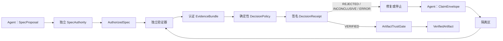

# Verification-First Harness

一个面向 Agent 工作流的实验性信任内核：**所有 Agent 输出默认都是不可信 Claim，
只有经过独立验证的 Artifact 才能向下游传播。**

项目优化的目标是错误隔离，而不是 Agent 数量。0.2.0 增加了与具体领域无关的 JSON
协议，用于授权规格、通用 Claim、认证证据、确定性判定、签名决策收据和能力式传播。
原有 Python 编码闭环作为兼容的参考适配器继续保留。

> 当前状态：Alpha / 研究原型。1.0 前协议和公共 API 可能调整。内置 Python
> 子进程执行器不是恶意代码安全沙箱。

[English](README.md)

## 七条核心原则

1. 每个 Agent 都不可信。
2. 每个输出都是 Claim，而不是事实。
3. 未验证 Claim 不得传播到下游。
4. Agent 应挑战前序工作，而不是盲目继承。
5. 优先使用独立验证，而不是 LLM 自我判断。
6. 失败、修复、重新验证属于正常控制流。
7. 系统优化错误隔离能力，而不是 Agent 数量。

这些原则由协议边界强制执行，不只是 Prompt 建议。Claim 会一直处于隔离状态，直到
授权规格、认证证据、确定性的 `VERIFIED` 判定和有效的一次性收据完全一致。只有这时
`ArtifactTrustGate` 才能签发携带 Claim 内容的 `VerifiedArtifact`。



## 0.2.0 已实现能力

- 将不可信 `SpecProposal` 与独立签名的 `AuthorizedSpec` 分开；
- Planner、Worker、Critic、Reviewer、Verifier、Master 和 Sub-Agent 共用不可变
  `ClaimEnvelope`；
- 明确区分 `VERIFIED`、`REJECTED`、`INCONCLUSIVE` 和 `ERROR`；
- 确定性策略检查验收标准、验证义务和观察结果之间的追踪关系；
- `EvidenceBundle` 与控制器签发的 `DecisionReceipt` 使用不同认证边界；
- 收据精确绑定 RunContext、Nonce、Spec、Claim、Attempt、Evidence 和协议版本；
- 一次性消费收据，并阻止跨运行重放；
- 通用接口中只有 `VerifiedArtifact` 能携带获准向下游传播的 Claim 内容；
- 提供规范化 JSON 证据/收据导出和哈希链式审计接口；
- 原有串行 Python 修复闭环已经接入通用内核，同时保留 0.1.x 结果字段；
- 保留 0.1.1 的失败关闭边界、Critic 权限限制、独立子进程和测试超时。

详细保证与假设请查看[七条原则覆盖矩阵](docs/invariants.md)、
[架构说明](docs/architecture.md)和[威胁模型](docs/threat-model.md)。

可直接运行的通用内核最小示例位于
[`examples/generic_kernel.py`](examples/generic_kernel.py)。

## 快速开始

需要 Python 3.10 或更高版本。

```bash
python -m venv .venv
python -m pip install -e .
python -m verification_harness.main
```

开发检查：

```bash
python -m pip install -e ".[dev]"
ruff check .
mypy src
pytest
python -m build
```

## Python 编码闭环示例

```python
from verification_harness.agents import (
    CriticAgent,
    PlannerAgent,
    VerifierAgent,
    WorkerAgent,
)
from verification_harness.engine import TrustGateEngine
from verification_harness.schema import TestCase

planner = PlannerAgent()
planner.register_task(
    task_id="add_one",
    description="Increment an integer.",
    requirements=("Return input plus one.",),
    test_cases=(TestCase("one", 1, 2),),
    entrypoint="add_one",
)

worker = WorkerAgent(
    faulty_implementations={"add_one": "def add_one(x): return x"},
    repaired_implementations={"add_one": "def add_one(x): return x + 1"},
)

result = TrustGateEngine(
    planner=planner,
    worker=worker,
    critic=CriticAgent(),
    verifier=VerifierAgent(signing_key=b"replace-with-32-or-more-secret-bytes"),
    max_repairs=1,
).run("add_one")

assert result["status"] == "APPROVED"
assert result["verdict"] == "VERIFIED"
assert result["artifact"] is not None
```

旧的 `claim` 和 `receipt` 字段仍可用于诊断与修复。只有 `artifact` 表示获准向下游
传播；拒绝或组件失败时始终是 `artifact=None`。

## 不同模型与不同领域

编码引擎依赖结构化接口，而不是某一家模型 API。可以同时接入 GPT Planner、Grok
Worker 和 Claude Critic。多模型可以降低相关错误，但不能替代独立证据，也不能授予
传播权限。

通用 `VerificationKernel` 不局限于 Python 源码。它使用独立的 JSON 负载，因此适配器
可以表示计划、研究结论、数学答案、文档、代码补丁或其他领域。但每个领域都必须提供：

- 验收标准的授权来源；
- 具有认证身份的独立证据收集器；
- 针对可理解证据的确定性判定规则；
- 与该领域风险相匹配的安全执行或检索边界。

如果不存在可信验证手段，正确结果应是 `INCONCLUSIVE`，而不是把 LLM 投票包装成验证。

## 必须理解的安全边界

本项目强制执行协议完整性和失败关闭控制流，但不能让同一 Python 进程里的任意代码变得
可信。同进程模块可以读取内存或 Monkey Patch 对象。因此，真正恶意的 Agent 适配器、
验证工具和候选程序需要进程、容器、microVM、虚拟机或操作系统级隔离，并限制凭据、
网络、文件系统、CPU、内存、磁盘、输出量和进程数。

内置重放注册表和审计存储只是单进程参考实现，不是持久化分布式安全服务。生产部署
需要事务型持久存储、外部密钥管理和加固后的验证器边界。

安全问题请按照[安全政策](SECURITY.md)报告。

## 当前限制

0.2.0 尚未提供仓库级验证插件、容器执行后端、持久化重放/审计存储、多 Worker 并行、
收据门控 DAG 调度或非代码领域包。Python 兼容适配器目前把旧检查较粗粒度地映射到
验收标准；新的领域适配器应建立更精确的追踪关系。

后续工作请查看[路线图](docs/roadmap.md)。项目使用 Apache-2.0 许可证。
