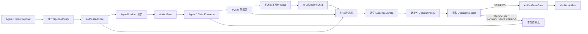

# Verification-First Harness

一个面向 Agent 工作流的实验性信任内核：**所有 Agent 输出默认都是不可信 Claim，
只有经过独立验证的 Artifact 才能向下游传播。**

项目优化的目标是错误隔离，而不是 Agent 数量。0.3.0 Beta 在 0.2.0 通用信任协议之上
增加了与厂商无关的串行 Runtime、第一方 Codex/OpenCode Provider、有边界的
Worker-to-Critic 调度、失败关闭的动作授权、验证器插件和带信任标签的 SQLite
持久化。原有 Python 编码闭环作为兼容的参考适配器继续保留。

> 当前状态：Beta / 研究原型。1.0 前协议和公共 API 可能调整。内置 Python
> 子进程执行器不是恶意代码安全沙箱。

[English](README.md)

## 七条核心原则

1. 每个 Agent 都不可信。
2. 每个输出都是 Claim，而不是事实。
3. 未验证 Claim 不得传播到下游。
4. Agent 应挑战前序工作，而不是盲目继承。
5. 优先使用独立验证，而不是 LLM 自我判断。
6. 失败、修复、重新验证属于正常控制流。
7. 系统优化错误隔离能力，而不是 Agent 数量。

这些原则由协议边界强制执行，不只是 Prompt 建议。Claim 会一直处于隔离状态，直到
授权规格、认证证据、确定性的 `VERIFIED` 判定和有效的一次性收据完全一致。只有这时
`ArtifactTrustGate` 才能签发携带 Claim 内容的 `VerifiedArtifact`。



## 0.3.0 Beta 新增能力

- 与厂商无关的 `AgentProvider`、`AgentRequest` 和分离式 `AgentOutput`；
- 使用 stdin/stdout 严格 JSON、禁止 Shell 插值的 `CommandAgentProvider`；
- 基于 OpenAI [官方 Python SDK](https://developers.openai.com/codex/sdk) 的可选
  `CodexAgentProvider`，每次请求使用新的临时 Thread、结构化输出、默认只读沙箱和
  限权后的审批/工具配置；
- 基于 OpenCode 非交互 CLI JSON 事件的 `OpenCodeAgentProvider`，要求显式工作目录，
  默认拒绝全部工具，可选只读权限，并对事件和最终输出进行本地严格解析；
- 可选的独立 Critic 阶段：Critic 只能选择控制器预先授权的检查，不能删除基线义务、
  创建验证命令、签发证据或决定 Verdict；
- 在 Agent 和 Verifier 执行前运行的 `ActionGate`，默认拒绝未列入允许表的动作；
- `VerifierRegistry` 和有超时、输出限制的 `CommandVerifierPlugin`；
- 有界的拒绝、修复和重新验证 `VerificationRuntime`；
- SQLite 中明确区分 `AUTHORIZED`、`QUARANTINED`、`AUTHENTICATED_EVIDENCE`、
  `DECISION_ONLY` 和 `VERIFIED`；
- 控制器重启后仍然有效的一次性收据消费；
- Runtime 演示和持久化记录检查 CLI。

底层 0.2.0 信任内核继续提供：

- 将不可信 `SpecProposal` 与独立签名的 `AuthorizedSpec` 分开；
- Planner、Worker、Critic、Reviewer、Verifier、Master 和 Sub-Agent 共用不可变
  `ClaimEnvelope`；
- 明确区分 `VERIFIED`、`REJECTED`、`INCONCLUSIVE` 和 `ERROR`；
- 确定性策略检查验收标准、验证义务和观察结果之间的追踪关系；
- `EvidenceBundle` 与控制器签发的 `DecisionReceipt` 使用不同认证边界；
- 收据精确绑定 RunContext、Nonce、Spec、Claim、Attempt、Evidence 和协议版本；
- 一次性消费收据，并阻止跨运行重放；
- 通用接口中只有 `VerifiedArtifact` 能携带获准向下游传播的 Claim 内容；
- 提供规范化 JSON 证据/收据导出和哈希链式审计接口；
- 原有串行 Python 修复闭环已经接入通用内核，同时保留 0.1.x 结果字段；
- 保留 0.1.1 的失败关闭边界、Critic 权限限制、独立子进程和测试超时。

详细保证与假设请查看[七条原则覆盖矩阵](docs/invariants.md)、
[架构说明](docs/architecture.md)和[威胁模型](docs/threat-model.md)。

可直接运行的通用内核最小示例位于
[`examples/generic_kernel.py`](examples/generic_kernel.py)。
Provider 线协议、Codex/OpenCode 接入、有边界 Challenge、信任标签和 Beta 安全边界请查看
[Verification Runtime 指南](docs/runtime.md)。

## 快速开始

需要 Python 3.10 或更高版本。

```bash
python -m venv .venv
python -m pip install -e .
python -m verification_harness.main
verification-harness-runtime demo
```

演示会输出 `run_id`，可检查该运行的持久化信任标签：

```bash
verification-harness-runtime inspect RUN_ID
```

开发检查：

```bash
python -m pip install -e ".[dev]"
ruff check .
mypy src
pytest
python -m build
```

## 直接接入 Codex SDK

安装可选的官方 SDK 集成：

```bash
python -m pip install -e ".[codex]"
```

然后在任何接受 `AgentProvider` 的位置传入 `CodexAgentProvider`：

```python
from pathlib import Path

from verification_harness import CodexAgentProvider, CodexSandbox

codex_worker = CodexAgentProvider(
    provider_id="codex/worker",
    cwd=Path.cwd(),
    codex_home=Path("work/codex-home"),
    sqlite_home=Path("work/codex-state"),
    sandbox=CodexSandbox.READ_ONLY,
)

result = runtime.run(
    proposal=proposal,
    provider=codex_worker,
    input_payload={"instruction": "提出一个候选补丁"},
    obligations=obligations,
    max_repairs=1,
)
```

官方 SDK 会复用所选 Codex Home 中的登录；Harness 不读取、复制、保存或打印凭据。
两个目录都必须预先存在，并且 SDK 进程必须能够写入。隔离 Home 应单独完成登录，
不要把个人 `auth.json` 复制进 Worktree。官方定义的 `CODEX_HOME` 同时承载配置、认证、
日志、Session 等状态，`CODEX_SQLITE_HOME` 只迁移 SQLite 状态，因此只读的个人 Home
仍不足以启动 App Server。Codex 返回的仍是不可信候选结果，只有通过独立验证后的
`result.artifact` 才拥有传播权限。

适配器会选择 Codex 的 `deny_all` 审批模式，并通过 SDK 配置覆盖禁用 Web Search、
App、Sub-Agent、依赖自动安装和 Workspace 网络。当前 Codex 的配置合并机制还不能
可靠清除用户本机配置中所有具名 MCP Server；生产运行仍需要干净的 Codex 配置目录，
或外层进程/容器隔离。

`CodexSandbox.WORKSPACE_WRITE` 必须显式指定目录，并且只能指向可丢弃或已隔离的
Worktree：候选生成阶段产生的文件改动本身不是已验证 Artifact。适配器有意不开放
Codex 的 `full_access`。

安装可选依赖后，可以运行完整的只读 Codex → 隔离区 → 独立验证器 → 收据门控示例：

```bash
python examples/codex_runtime.py `
  --codex-home work/codex-home `
  --codex-sqlite-home work/codex-state
```

该命令会使用你已有的 Codex 账号进行一次真实模型调用。最终 JSON 会列出每次尝试的
Verdict，并且只有 `artifact` 字段可能携带获准传播的内容。

## 接入 OpenCode Critic

安装并登录 OpenCode CLI 后，它既可以作为 Worker，也可以作为 Critic。跨 Provider
有边界流程如下：

```python
from pathlib import Path

from verification_harness import OpenCodeAgentProvider, OpenCodePermissionProfile

opencode_critic = OpenCodeAgentProvider(
    provider_id="opencode/critic",
    cwd=Path.cwd(),
    profile=OpenCodePermissionProfile.DENY_ALL,
)

result = runtime.run(
    proposal=proposal,
    provider=codex_worker,
    critic_provider=opencode_critic,
    input_payload=task_input,
    obligations=mandatory_obligations,
    challenge_obligations=optional_controller_owned_checks,
    max_repairs=1,
)
```

运行 `python examples/codex_opencode_challenge.py` 可以体验完整的 Codex Worker →
OpenCode Critic → 独立 Python Verifier 流程。它会复用本机已有认证，并可能消耗两个
服务的模型额度。OpenCode 权限只是纵深防御，本地 CLI 不是操作系统安全沙箱。

## Python 编码闭环示例

```python
from verification_harness.agents import (
    CriticAgent,
    PlannerAgent,
    VerifierAgent,
    WorkerAgent,
)
from verification_harness.engine import TrustGateEngine
from verification_harness.schema import TestCase

planner = PlannerAgent()
planner.register_task(
    task_id="add_one",
    description="Increment an integer.",
    requirements=("Return input plus one.",),
    test_cases=(TestCase("one", 1, 2),),
    entrypoint="add_one",
)

worker = WorkerAgent(
    faulty_implementations={"add_one": "def add_one(x): return x"},
    repaired_implementations={"add_one": "def add_one(x): return x + 1"},
)

result = TrustGateEngine(
    planner=planner,
    worker=worker,
    critic=CriticAgent(),
    verifier=VerifierAgent(signing_key=b"replace-with-32-or-more-secret-bytes"),
    max_repairs=1,
).run("add_one")

assert result["status"] == "APPROVED"
assert result["verdict"] == "VERIFIED"
assert result["artifact"] is not None
```

旧的 `claim` 和 `receipt` 字段仍可用于诊断与修复。只有 `artifact` 表示获准向下游
传播；拒绝或组件失败时始终是 `artifact=None`。

## 不同模型与不同领域

Runtime 依赖结构化接口，而不是某一家模型 API。Codex 使用第一方 SDK 适配器，
OpenCode 使用第一方 CLI 适配器，其他 SDK 可以通过 `CallableAgentProvider` 接入，
其他本地工具可以使用严格的 `CommandAgentProvider` 协议。当前 Beta 可以串行调度
一个 Worker 和一个可选的不同 Critic，但还不会运行并行分支或收据门控 DAG。模型
多样性有助于降低相关错误，但不能代替独立证据，也不会自动赋予传播权限。

通用 `VerificationKernel` 不局限于 Python 源码。它使用独立的 JSON 负载，因此适配器
可以表示计划、研究结论、数学答案、文档、代码补丁或其他领域。但每个领域都必须提供：

- 验收标准的授权来源；
- 具有认证身份的独立证据收集器；
- 针对可理解证据的确定性判定规则；
- 与该领域风险相匹配的安全执行或检索边界。

如果不存在可信验证手段，正确结果应是 `INCONCLUSIVE`，而不是把 LLM 投票包装成验证。

## 必须理解的安全边界

本项目强制执行协议完整性和失败关闭控制流，但不能让同一 Python 进程里的任意代码变得
可信。同进程模块可以读取内存或 Monkey Patch 对象。因此，真正恶意的 Agent 适配器、
验证工具和候选程序需要进程、容器、microVM、虚拟机或操作系统级隔离，并限制凭据、
网络、文件系统、CPU、内存、磁盘、输出量和进程数。

Beta 版 SQLite 运行和收据存储可以跨本地控制器重启持久化，但不是经过认证的分布式
安全服务；哈希链审计存储仍是单进程实现。生产部署需要事务型分布式存储、外部密钥
管理和加固后的验证器边界。

安全问题请按照[安全政策](SECURITY.md)报告。

## 当前限制

0.3.0 Beta 尚未内置容器执行后端、持久化哈希链审计、仓库/补丁 Claim 类型、验证器包、
多 Worker 并行、收据门控 DAG 或非代码领域包。Codex SDK 目前依赖 SDK 自身的取消
机制，OpenCode/Codex 的应用级权限也不是容器边界。命令适配器可能继承调用者环境，
输出限制也在捕获后检查，因此不是恶意进程安全沙箱。Python 兼容适配器目前把旧检查
较粗粒度地映射到验收标准；新领域适配器应建立更精确的追踪关系。

后续工作请查看[路线图](docs/roadmap.md)。项目使用 Apache-2.0 许可证。
